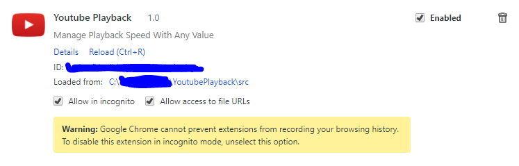

# TL; DR

* **clone** via **git** to your harddrive (or download zip, meh)

* open chrome, go to **extensions** *(chrome://extensions)*

* **enable developer mode** (click *checkbox*)

* click "Load unpacked extension..." locate the folder with the dialog locate the "src" folder then click	ok

## Example Preview (Loaded)

## Example in use:

